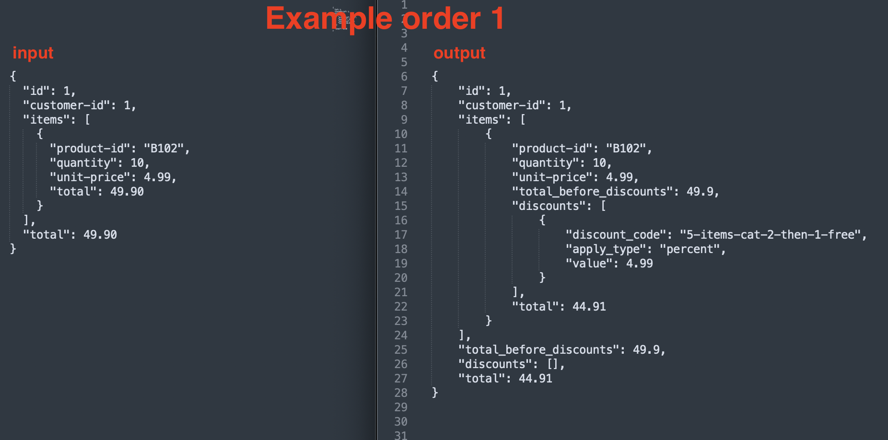
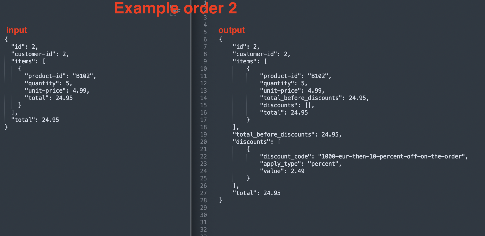
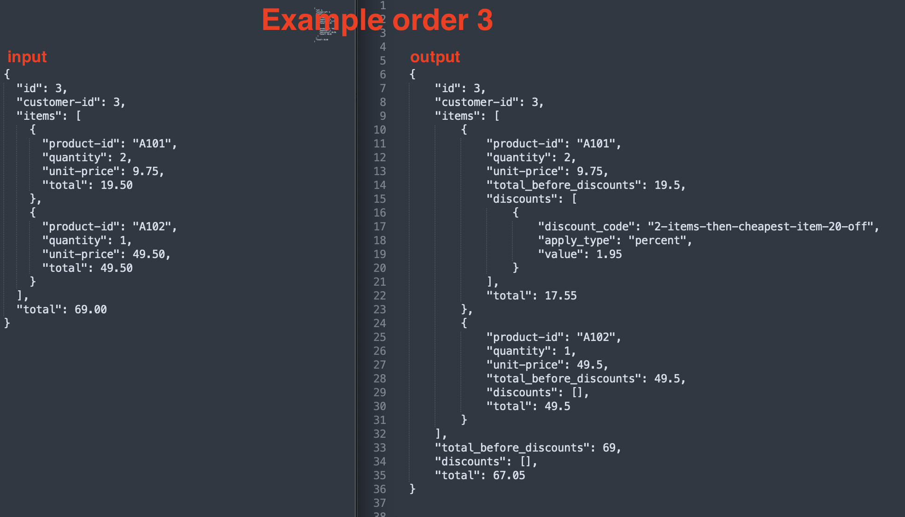

## Table of Contents
- [Initial Requirements](#initial-requirements)
- [My Approach](#my-approach)
- [Liberties I Took](#liberties-i-took)
- [Screenshots of Results (Input / Output)](#screenshots-of-results-input-and-output)
- [How to Run](#how-to-run)

### Initial requirements

- to build a microservice that can take input data related to orders, process and apply discounts and return a payload.
- Three ways of getting discounts defined in the initial reqs - and a mention that there can be more ways in the future:
    - For every product of category "Switches" (id 2), when you buy five, you get a sixth for free.
    - A customer who has already bought for over € 1000, gets a discount of 10% on the whole order.
    - If somebody buys two or more products of category "Tools" (id 1), you get a 20% discount on the cheapest product.

### My approach

- **A. I wanted to make the discounts very flexible, modular, and scalable**:
    - This means that they can be percent or fixed relative to either an item, or the order.
    - I wanted a way to easily add new logic / quirks to discounts, so for the configuration, I used a flexible array to add as many keys as we want, without having to change db structure.
    - Each discount has a factory and validates this modular "configuration" array as needed, for each type of discount.
    - I added priority **on the discount entity**, not on the discount **processors**. This means that different discount types can be ordered and applied arbitrarily, even like so: [A, B, B, A, C, A, B]
- **B. The validations for creating discounts (each with its own discount factory), are also modular**:
    - For example, out of the three discounts described in the requirements, two of them share the "requiredQty" validation in the factory (even if _applying_ the discount works differently for those two discounts).
    - Or, the same two needing to define a category id and sharing a reusable constraint validation
- C. The output payload is pretty much identical to the input payload, but with a "discounts" array on both the item(s) as well as the order. These discounts look the same for the "order" but also for the "items", for code reusability (for API clients also)..

### Liberties I took
- To avoid boilerplate unnecessary for a coding challenge:
    - I wrote fake repositories for discounts & customers & products & product categories (ie there is no actual db).
    - In the example orders provided, everything is a string. I changed to ints and floats where sensible.
    - For the "order total" discount, it would be sensible to also write an order distributor to distribute said discount on all of the items also. But I felt it's out of scope for this task, just know I considered it also.

### Screenshots of results (input and output)
(if you don't have time to pull and run the code)

______
### How to run
